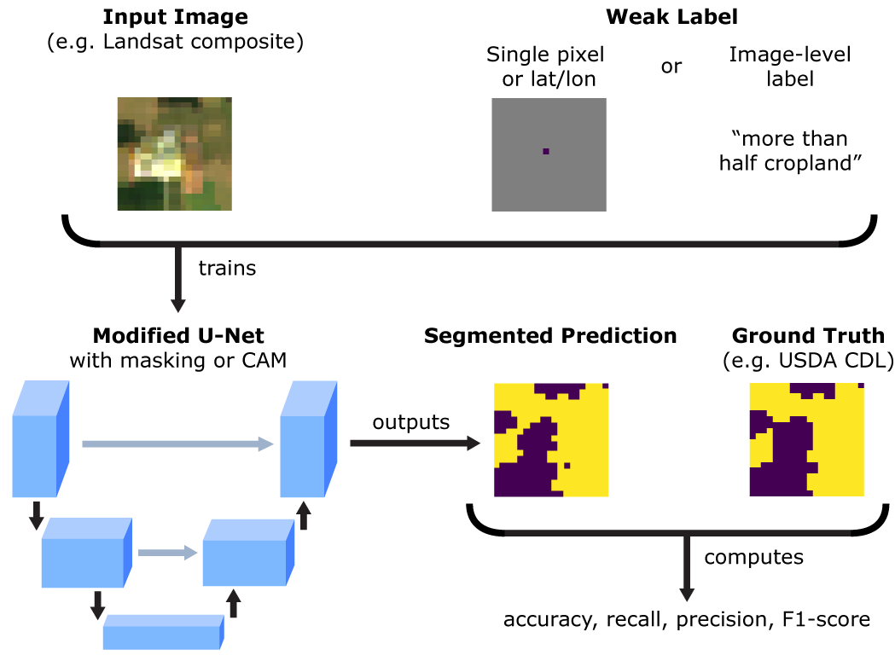

# Weakly Supervised Deep Learning for Segmentation of Remote Sensing Imagery

This repo contains the implementation of weakly supervised segmentation for remote sensing imagery from [our Remote Sensing paper](https://www.mdpi.com/2072-4292/12/2/207/htm). We perform cropland segmentation using two types of labels commonly found in remote sensing datasets that can be considered sources of “weak supervision”: (1) labels comprised of single geotagged points and (2) image-level labels.

<p align="center">

</p>

## Usage

To train a U-Net on single-pixel labels, run
```bash
cd single_pixel_labels
python src/run_masked.py --model_dir ./experiments
```

To train a U-Net on image-level labels, run
```bash
cd image_labels
python src/run_UCAM.py --model_dir ./experiments
```

Note that the code for the single-pixel labels was written in PyTorch, while the code for the image-level labels was written in TensorFlow 1.x.


## Data and Experimental Setup

The models, datasets, and data loaders are currently written to process Landsat tiles in either `.tfrecord` (for the image-level labels) or `.npy` (for the single-pixel labels) formats. The last layer of the `.tfrecord` or `.npy` files are assumed to be the segmentation ground truth label.

In each `experiments` directory is a `params.json` file that defines the data directory, training/val/test split file names, model architecture, number of channels in the input data, data augmentation procedures to use, and what model outputs to save. The `--model_dir` flag must point to the directory with a valid `params.json` file in order for training to proceed.

## Citation

When using the code from this repo, please cite:
* S. Wang, W. Chen, S. M. Xie, G. Azzari, and D. B. Lobell, “Weakly Supervised Deep Learning for Segmentation of Remote Sensing Imagery,” Remote Sensing, vol. 12, no. 2, p. 207, Jan. 2020, doi: 10.3390/rs12020207.

Please feel free to email sherwang [at] stanford [dot] edu with any questions about the code or suggestions for improvement.
